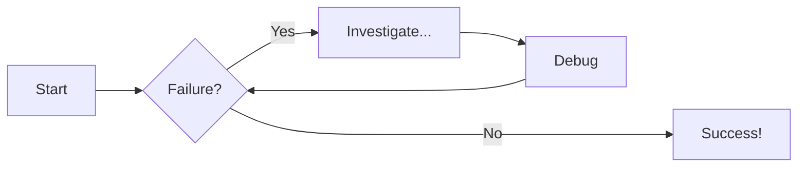
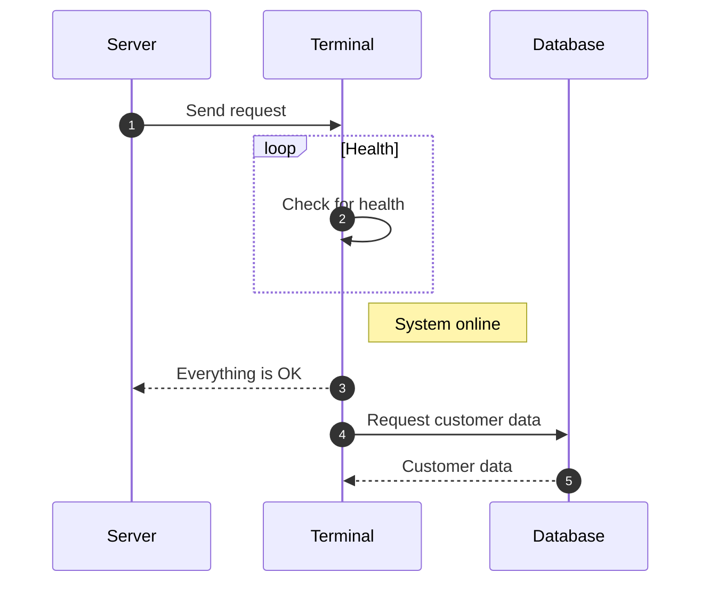

Diagrams

Material for MkDocs allows you to easily implement statically rendered diagrams in your documentation. Examples of diagrams you might include are:

    Flow charts
    Sequence diagrams
    State diagrams
    Class diagrams
    Entity-relationship diagrams

## Flowcharts

## Sequence Diagrams

